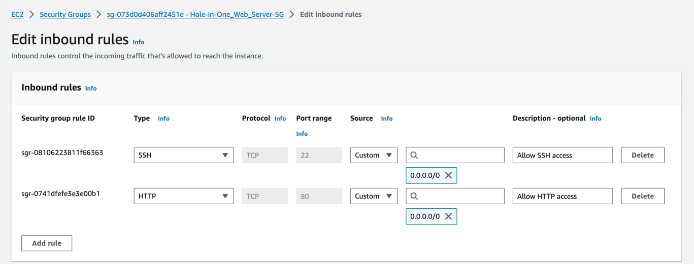
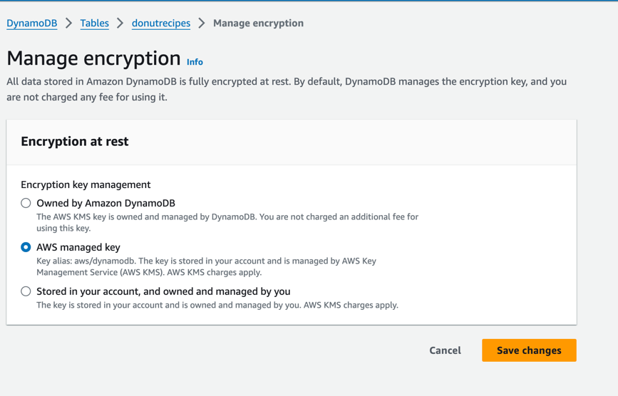

# Donut Recipe Stolen!

## Overview
The recipe development team at Hole-in-One Donuts recently developed a revolutionary donut recipe that they believed
would take the donut world by storm.

A huge marketing campaign was launched to bolster public interest, but a week before launch, their competitor Dubious
Donuts released a new line of donuts that appeared to use the secret recipe developed by Hole-in-One - a clear
indication that Dubious Donuts was accessing data in Hole-in-One's AWS account.

Can you identify and remediate the configuration vulnerabilities that resulted in the stolen intellectual property?

## Tasks
## Task 1 - The Challenge Begins

### Background
It's fitting that a donut shop would have a hole right in the middle of its defenses, right?

As you sit down at your predecessor's old desk and log in to the Hole-in-One AWS account for the first time, you notice
a pad of paper with some notes scribbled on it. The notes seem to reference config monitoring and compliance checks that
were put in place earlier this year. It sounds like some security configuration checks were put in place, but apparently
no one was keeping an eye on their status. With that in mind, you begin your investigation into how the donut recipe may
have been exposed.

### Your Task

It is critical to review AWS resources and disable public internet access where not required.

Take action to identify and remediate any publicly accessible AWS resources that should not be internet facing. This
will improve the security posture of your AWS environment.

###  Getting Started
Browse to the AWS Config service. This service monitors and records the configuration of resources in your account.

Find and resolve the issue identified with the Task1- rule established by your predecessor.

###  Related Inventory
An AWS Config rule with a name that begins with Task1- 
* An Amazon Elastic Compute Cloud (Amazon EC2) instance named Hole-in-One_Web_Server 
* A Security Group associated with the Amazon EC2 Instance

### Task Validation
Once you have mitigated the vulnerability, click the Check my progress button above.

IMPORTANT: You should NOT wait for the compliance status of the relevant AWS Config rule to change before clicking the
Check my progress button. Once you have resolved the underlying issue, click the Check my progress button - if you have
resolved the issue, the task will be completed regardless of the current AWS Config rule status.

## Solution

Before:

---
## Task 2 

### Your Task
You need to identify and remediate the another configuration in your account that is not compliant with company policy.

#### Getting Started
Browse again to the AWS Config service. Find and resolve the issue detected by the Task2-* rule.

#### Inventory
An AWS Config rule with a name that begins with Task2-
* A Amazon DynamoDB table 
* An AWS KMS customer managed key (if needed).

#### Task Validation
Once you have fixed the non-compliant configuration, click the Check my progress button above. It may take a few seconds
for the changes to take effect before the validation process recognizes completion. Feel free to check your progress
again if it is not detected right away.

IMPORTANT: You should NOT wait for the compliance status of the relevant AWS Config rule to change before clicking the
Check my progress button. Once you have resolved the underlying issue, click the Check my progress button - if you have
resolved the issue, the task will be completed regardless of the current AWS Config rule status.

#### SOlution
