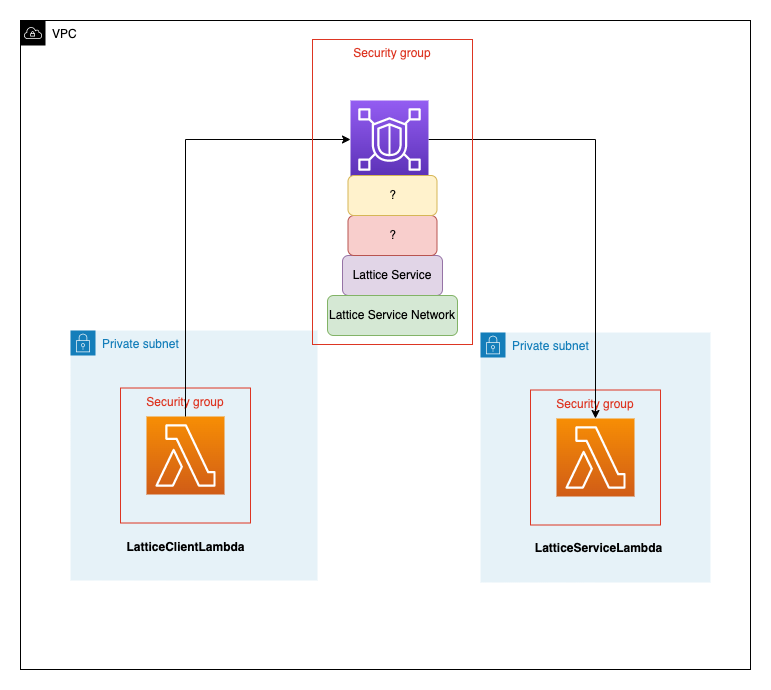

# VPC Lattice Lambda Quest - Application Networking

## Overview

In this scenario, we've developed a duo of AWS Lambda Functions – one functioning as a Client and the other as a
Service. Both are nestled within an Amazon VPC and reside in a Private Subnet, completely devoid of any connection to
the Public Internet. Your objective is to unveil the Service Lambda Function as a Service Endpoint, facilitating
responses to HTTPS requests. This entails orchestrating application networking so that the Client Lambda Function, which
initiates HTTPS requests, can engage with the Service Lambda Function using the capabilities of the Amazon VPC Lattice.

The Amazon VPC Lattice functions as a comprehensive application networking solution, guaranteeing consistent
connectivity, continuous monitoring, and heightened security to ensure smooth communication across your array of
services.

## Tasks

### Task 1

#### Background

Two AWS Lambda functions have been implemented, with LatticeServiceLambda serving as a Service Lambda Function. This
function is designed to respond upon requests from LatticeClientLambda, which acts as a Client Function. While we have
established a basic application networking setup using Amazon VPC Lattice, it remains incomplete.

In the current stage, when attempting to invoke LatticeClientLambda, the connection to the appropriate Service Endpoint
for LatticeServiceLambda cannot be established. Consequently, the invocation fails. Prior to identifying the Lattice
Service endpoint, there is a task that needs to be completed.

#### Your Task

Your objective is to first group LatticeServiceLambda to run it as Service. Essentially this will route requests to one
or more registered targets.

#### Getting Started

* Click on Open AWS Console
* Navigate to VPC Service where you can find the `reinvent23-lattice-vpc`, `reinvent23-private-destination-subnet`
  and `reinvent23-private-source-subnet`
* Navigate to VPC and from there on the left pane, select VPC Lattice > Service Networks. A Service Network has been
  created with name reinvent23-lattice-service-network. This service network is associated with `reinvent23-lattice-vpc`
* Navigate to VPC and from there on the left pane, select VPC Lattice > Services. A Lattice Service has been created
  with name `reinvent23-lattice-service` and this Lattice Service is Associated
  with `reinvent23-lattice-service-network`

#### Inventory

Your AWS account has been provisioned with the following resources:

* AWS Lambda Function: LatticeServiceLambda and LatticeClientLambda
* AWS VPC: reinvent23-lattice-vpc
* AWS VPC Lattice Service Network: reinvent23-lattice-service-network
* AWS VPC Lattice Service: reinvent23-lattice-service

#### Task Validation

Task will be validated automatically once LatticeServiceLambda has been placed in Target group

#### Solution

We created target groups for `LatticeServiceLambda` in the VPC Lattice.
Refer [this](https://docs.aws.amazon.com/vpc-lattice/latest/ug/create-target-group.html)

---

### Task 2

#### Background

Since you have successfully created a VPC Lattice target group, lets create a process that checks for connection
requests, using the protocol and port that you configure. The rules that you define for this process, determine how the
service routes requests to its registered targets.

#### Your Task

Your objective is to create a Listener for the VPC Lattice Target Group with right Port and Protocol. We should have a
secure communication mode at Application layer

#### Task Validation

Task will be validated automatically once you have successfully created a Listener for the VPC Lattice Target Group

#### Solution

Created a Listener in the target group. Refer [this](https://docs.aws.amazon.com/vpc-lattice/latest/ug/listeners.html)

---

### Task 3

#### Background

Well, we are almost there when we can make the Client Service communication.

LatticeClientLambda has been configured with an environment variable ENDPOINT which is being used by the Lambda function
code to send POST request. The ENDPOINT environment variables is not configured correctly.

#### Your Task

Your objective is update ENDPOINT environment variable of LatticeClientLambda and invoke the Function. This is related
to the AWS VPC Lattice Service, which we had already setup for you.

#### Getting Started

* Click on Open AWS Console
* Navigate to VPC Service where you can find the `reinvent23-lattice-vpc`, `reinvent23-private-destination-subnet` and
  `reinvent23-private-source-subnet`
* Navigate to Lambda Service and select the LatticeClientLambda. Go to Configuration tab, and select Environment
  variables
  on the Lambda Function Console.
* You Will find a Environment Variable with Key : ENDPOINT and Value : `UpdateMeWithLatticeServiceDomainName`
* Navigate to VPC and from there on the left pane, select VPC Lattice > Services. A Lattice Service has been created
  with
  name `reinvent23-lattice-service` and this Lattice Service is Associated with `reinvent23-lattice-service-network`

#### Task Validation
After you've modified the value of Key: ENDPOINT with the accurate entry and invoked the LatticeClientLambda, once it
successfully runs, your task will be automatically marked as completed.

#### Solution
Update the endpoint env variable with the endpoint in the listener ?

